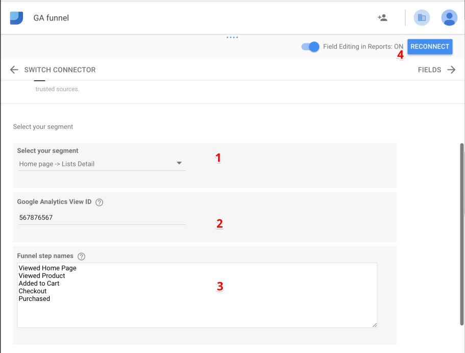
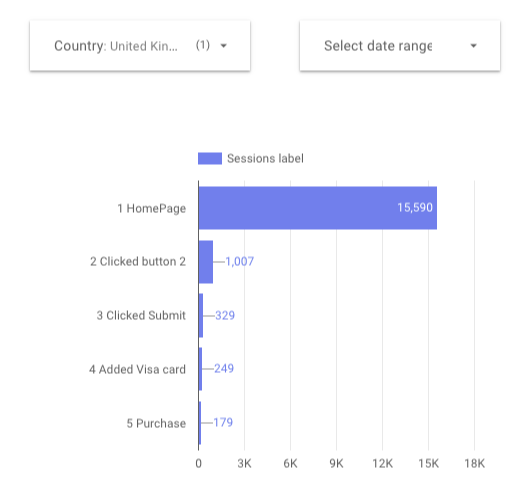

# Data studio connector
## Create Google Analytics funnel, based on Sequence Segment

Google Analytics Sequence Segment lets you build any user flow using events, pageviews and other.
When you create segment a->b->c->d, addon splits it in 4 subsegments:
1. a
2. a->b
3. a->b->c
4. a->b->c->d

and make 4 google analytics API requests
## Instalation

1. Open [connector](https://datastudio.google.com/datasources/create?connectorId=AKfycbwQ9774vh93_eKAhy9Qf5Phrvm7AsoVeE7VPd23No98RmdvRfE7ndwPzh4Jh5mKRjrn) (*).
2. Click authorization.
3. Fill in configuration:
    1) Choose Sequence Segment, if you don't have one add [demo segment](https://analytics.google.com/analytics/web/template?uid=BYYcDsLZSpuZNqSO9XZ-NQ) (**).
    2) Add Google Analytics viewID (***).
    3) Add segments readible name. Each step in new line (optional).
    4) Connect datasource.

Default breakdown dimension - 'Country'

@TODO breakdown dimension picker

Funnel Visualisation

(*) Connector:
https://datastudio.google.com/datasources/create?connectorId=AKfycbwQ9774vh93_eKAhy9Qf5Phrvm7AsoVeE7VPd23No98RmdvRfE7ndwPzh4Jh5mKRjrn

(**) Demo Sequence Segment
https://analytics.google.com/analytics/web/template?uid=BYYcDsLZSpuZNqSO9XZ-NQ

(***) Find your Google Analytics viewID in "Google Analytics Account Explorer"
https://ga-dev-tools.appspot.com/account-explorer/
[//]: i/gaSequence.png